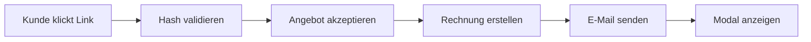

# WHMCS Action Hook: Accept Quote without Login

[](https://www.whmcs.com)
[](https://www.php.net)
[](LICENSE)

**Ermöglicht Kunden, WHMCS-Angebote direkt per E-Mail-Link zu akzeptieren – ohne Login erforderlich.**


## 📋 Übersicht

Dieser Action Hook erweitert WHMCS um eine praktische Funktion: Kunden können Angebote (Quotes) direkt über einen sicheren Link in der Angebots-E-Mail akzeptieren, ohne sich im Kundenportal anmelden zu müssen. Nach der Annahme wird automatisch eine Rechnung erstellt und versendet.

### ✨ Hauptfunktionen

- ✅ **Ein-Klick-Akzeptierung** – Kunden akzeptieren Angebote direkt aus der E-Mail
- 🔒 **Sicher** – Hash-basierte Verifizierung (Quote-ID + Client-ID + E-Mail)
- 🧾 **Automatische Rechnungserstellung** – Rechnung wird sofort erstellt und per E-Mail versendet
- 💬 **Benutzerfreundliches Modal** – Ansprechende Bestätigungsmeldung nach Akzeptierung
- 🌐 **Mehrsprachig** – Einfach anpassbar für verschiedene Sprachen
- 🔄 **Modern & Sicher** – Optimiert für WHMCS 9.0+ und PHP 8.1/8.2/8.3

### 🎯 Anwendungsfall

**Problem:** Kunden müssen sich in WHMCS einloggen, um Angebote zu akzeptieren – das führt oft zu:
- Vergessenen Passwörtern
- Unnötigen Support-Anfragen
- Verzögerungen im Verkaufsprozess

**Lösung:** Mit diesem Hook können Kunden Angebote mit einem Klick direkt aus der E-Mail akzeptieren!

## 🚀 Installation

### Schritt 1: Datei hochladen

Lade die Datei `zigetik_accept_quote_without_login.php` in das Hook-Verzeichnis:

```bash
/pfad/zu/whmcs/includes/hooks/zigetik_accept_quote_without_login.php
```

### Schritt 2: Fertig!

Der Hook wird automatisch aktiviert. Keine weitere Konfiguration nötig.

### Schritt 3: Testen

1. Erstelle ein neues Angebot in WHMCS
2. Versende es an einen Test-Kunden
3. Klicke auf den Link in der E-Mail
4. Das Angebot wird automatisch akzeptiert ✅

## 📊 Funktionsweise

### 1. E-Mail-Link-Generierung

Beim Versand der Angebots-E-Mail wird der Standard-Link durch einen sicheren Hash-Link ersetzt:

**Vorher:**
```
https://deinwhmcs.de/viewquote.php?id=123
```

**Nachher:**
```
https://deinwhmcs.de/index.php?qhash=abc123def456-123
```

### 2. Hash-Verifizierung

Der Hash wird aus folgenden Komponenten generiert:

```php
$hash = strrev(md5($quote_id . $client_id . $email)) . '-' . $quote_id
```

Dies stellt sicher, dass:
- Nur der richtige Kunde das Angebot akzeptieren kann
- Der Link nicht erraten werden kann
- Jeder Link eindeutig ist

### 3. Automatische Abwicklung



## 🎨 Anpassung

### Sprache ändern

Passe die Modal-Texte in Zeile 85-95 an:

```javascript
if (titleEl) titleEl.innerHTML = 'Quote #' + quoteId + ' Accepted';
if (bodyEl) {
    bodyEl.innerHTML = `
        <div class="container">
            <div class="row">
                <div class="col-md-8">
                    <h4>Hey, ${firstname}</h4>
                    <p>Thanks for accepting quote <strong>#${quoteId}</strong> (${subject})...</p>
                </div>
            </div>
        </div>
    `;
}
```

### Design anpassen

Das Modal verwendet Bootstrap-Klassen. Überschreibe das Styling in deinem Template:

```css
#modalAjax .modal-title {
    color: #1a73e8;
    font-weight: bold;
}

#modalAjax .modal-body {
    background: linear-gradient(135deg, #667eea 0%, #764ba2 100%);
    color: white;
}
```

### E-Mail-Template

Der Hook nutzt das Standard-Template **"Quote Delivery with PDF"**. Passe es an unter:

```
WHMCS Admin → Setup → Email Templates → Quote Delivery with PDF
```

## ⚙️ Technische Details

### Verwendete Hooks

| Hook | Funktion |
|------|----------|
| `EmailPreSend` | Modifiziert den Quote-Link in der E-Mail |
| `ClientAreaHeadOutput` | Verarbeitet den Hash und akzeptiert das Angebot |

### Sicherheitsmerkmale

✅ **SQL-Injection-Schutz** – Laravel Query Builder (Capsule)  
✅ **XSS-Schutz** – `htmlspecialchars()` für alle Ausgaben  
✅ **Input-Validierung** – Strikte Prüfung aller GET-Parameter  
✅ **Hash-Verifizierung** – Mehrstufige Validierung  
✅ **Einmalige Verwendung** – Links für bereits akzeptierte Angebote werden ungültig

### Systemanforderungen

| Anforderung | Version |
|-------------|---------|
| WHMCS | 9.0 oder höher |
| PHP | 8.1, 8.2, 8.3 |
| MySQL/MariaDB | 5.7+ / 10.3+ |
| Bootstrap | 4.x oder 5.x |

### Datenbankzugriff

Der Hook verwendet folgende Tabellen (read-only):

- `tblquotes` – Angebotsdaten
- `tblclients` – Kundendaten

Schreibzugriff erfolgt nur über WHMCS API:

- `AcceptQuote` – Angebot akzeptieren
- `SendEmail` – Rechnung versenden

## 🔧 Troubleshooting

### Problem: Link funktioniert nicht

**Lösung:**
```bash
# 1. Prüfe ob Hook-Datei existiert
ls -la /pfad/zu/whmcs/includes/hooks/zigetik_accept_quote_without_login.php

# 2. Prüfe Dateiberechtigungen
chmod 644 /pfad/zu/whmcs/includes/hooks/zigetik_accept_quote_without_login.php

# 3. Prüfe Activity Log
WHMCS Admin → Utilities → Logs → Activity Log
```

### Problem: Modal wird nicht angezeigt

**Ursachen & Lösungen:**

| Ursache | Lösung |
|---------|--------|
| JavaScript-Fehler | Browser-Konsole (F12) prüfen |
| Bootstrap nicht geladen | Template-Dateien überprüfen |
| Template-Inkompatibilität | Vanilla-JS-Fallback aktiviert sich automatisch |

### Problem: Rechnung wird nicht erstellt

**Prüfe:**

1. **Invoice Settings:**
   ```
   WHMCS Admin → Setup → General Settings → Invoices
   ✓ "Auto Create Invoice" aktiviert
   ```

2. **E-Mail-Template:**
   ```
   Setup → Email Templates → Invoice Created
   ✓ Template aktiv
   ```

3. **Activity Log:**
   ```
   Suche nach: "Quote Accept Error"
   ```

## 📝 Code-Beispiele

### Activity Log Einträge

Nach erfolgreicher Akzeptierung:

```
[2024-02-09 14:23:45] Quote #123 accepted via email link
[2024-02-09 14:23:46] Invoice #456 created from Quote #123
```

### Modal-Ausgabe (Deutsch)

```html
┌─────────────────────────────────────────┐
│  Angebot #123 akzeptiert                │
├─────────────────────────────────────────┤
│                                         │
│  Hallo Max,                             │
│                                         │
│  vielen Dank für die Annahme des        │
│  Angebots #123 (Webhosting Premium).    │
│                                         │
│  So geht es weiter:                     │
│  • Rechnung folgt in Kürze per E-Mail   │
│  • Nach Zahlung: sofortige Aktivierung  │
│                                         │
│  [Kontakt aufnehmen]  [Zum Shop]        │
└─────────────────────────────────────────┘
```

## 🧪 Testing

### Manueller Test

```php
// 1. Erstelle Test-Quote
WHMCS Admin → Sales → Quotes → Create Quote

// 2. Versende Quote
Send → Quote Delivery with PDF

// 3. Prüfe E-Mail
Link sollte sein: index.php?qhash=...

// 4. Klicke Link
Modal sollte erscheinen + Rechnung wird erstellt
```

### Automatisierter Test (Optional)

```bash
# PHPUnit Test erstellen
tests/QuoteAcceptTest.php
```

## 🤝 Beitragen

Contributions sind willkommen! So kannst du helfen:

1. **Fork** das Repository
2. **Erstelle** einen Feature-Branch (`git checkout -b feature/AmazingFeature`)
3. **Commit** deine Änderungen (`git commit -m 'Add some AmazingFeature'`)
4. **Push** zum Branch (`git push origin feature/AmazingFeature`)
5. **Öffne** einen Pull Request

### Development Guidelines

- Code nach **PSR-12** formatieren
- **Kommentare** auf Englisch
- **Commit-Messages** aussagekräftig
- **Tests** für neue Features

## 📜 Changelog

### Version 2.1 (2024-02-09)

- ✅ WHMCS 9.0 Kompatibilität
- ✅ PHP 8.2/8.3 Support
- ✅ Bootstrap 5 Unterstützung
- ✅ Verbesserte Sicherheit (Prepared Statements)
- ✅ XSS-Schutz hinzugefügt
- ✅ Error-Handling verbessert
- ✅ Deutsche Lokalisierung

### Version 1.0 (Original)

- Erste Version von Katamaze
- Basis-Funktionalität

## 📄 Lizenz

MIT License

```
Copyright (c) 2024 ZIGetik Webservices

Permission is hereby granted, free of charge, to any person obtaining a copy
of this software and associated documentation files (the "Software"), to deal
in the Software without restriction, including without limitation the rights
to use, copy, modify, merge, publish, distribute, sublicense, and/or sell
copies of the Software, and to permit persons to whom the Software is
furnished to do so, subject to the following conditions:

The above copyright notice and this permission notice shall be included in all
copies or substantial portions of the Software.

THE SOFTWARE IS PROVIDED "AS IS", WITHOUT WARRANTY OF ANY KIND, EXPRESS OR
IMPLIED, INCLUDING BUT NOT LIMITED TO THE WARRANTIES OF MERCHANTABILITY,
FITNESS FOR A PARTICULAR PURPOSE AND NONINFRINGEMENT.
```

## 👨‍💻 Credits

**Entwickelt von:**  
🚀 **ZIGetik Webservices**  
📧 kontakt@zigetik.com  
🌐 https://zigetik.com

**Basierend auf dem Original-Konzept von:**  
💡 [Katamaze](https://katamaze.com)

## ⭐ Support & Community

- 🐛 **Bug melden:** [GitHub Issues](../../issues)
- 💡 **Feature Request:** [GitHub Discussions](../../discussions)
- 📧 **Direkt-Support:** info@zigetik.com
- 📚 **WHMCS Docs:** https://docs.whmcs.com

---

<div align="center">

**Gefällt dir das Projekt?**  
Gib uns einen ⭐ auf GitHub!

[⬆ Nach oben](#whmcs-action-hook-accept-quote-without-login)

</div>
